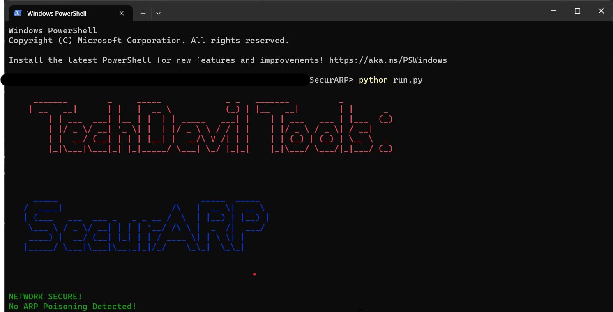

# SecurARP

SecurARP is a cutting-edge network security tool designed to detect and thwart ARP Spoofing attacks. By accessing Address Resolution Protocol (ARP) traffic within your network, SecurARP identifies any malicious attempts to manipulate the ARP tables and redirect network traffic. SecurARP provides an essential layer of protection against this common and insidious form of attack, ensuring the integrity and security of your network infrastructure. Stay one step ahead of potential threats with SecurARP, the ultimate safeguard against ARP Spoofing.

## Table of Contents

- [Installation](#installation)
- [Usage](#usage)
- [Features](#features)
- [Contact Me](#contact-me)

## Installation

To get a local copy of this project, you can clone it using Git. Follow the steps below:

1. Open Command Prompt.
2. Change the current working directory to the location where you want the cloned directory to be saved.
3. Run the following command to clone the repository:

   ```shell
   git clone https://github.com/omsahare-14/SecurARP
   ```
4. After executing the command, the repository will be cloned to your local machine.

Now you have a local copy of the project to work with.

## Usage

To run this tool, open 'main.py' file in CMD.
   
   ```shell
   python main.py
   ```


Run the 'help' command to view all the available commands. Type any one of the commands and follow the on-screen instructions to use that command


## Features

- Password Protection: All your folders/files are password protected. The password are stored in secure manner to prevent password theft in any manner.
- Webcam Security: If someone enters incorrect password for 3 times, their snapshot is captured by the webcam to later identify the perpetrator.
- Hide Folder: All your sensitive and secret data stored inside the folder is hidden in a secure manner to prevent data theft.

## Contact Me

If you have any questions, feedback, or suggestions, feel free to reach out to me.

- Name: Om Sahare
- Email: [omsahareofficial@gmail.com](mailto:omsahareofficial@gmail.com)
- LinkedIn: [om-sahare-253b30207/](https://www.linkedin.com/in/om-sahare-253b30207/)
- Twitter: [@omsahare14](https://twitter.com/omsahare14)

